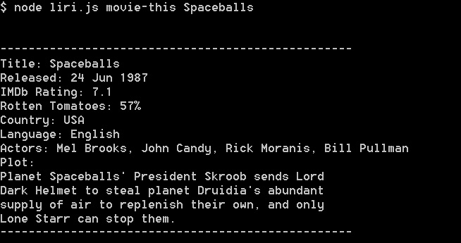

# LIRI for Node
LIRI is a Language Interpretation and Recognition Interface for accessing information from some popular APIs.

## About
LIRI for Node.js is a command line application that displays Tweets, song information, or movie information. Liri accepts various commands and retrieves information from popular APIs including [OMDB](http://www.omdbapi.com/), [Twitter](https://dev.twitter.com/), and [Spotify](https://developer.spotify.com/).

This application has been made to satisfy the specifications for homework assignment #10 for the Coding Bootcamp at UCSD Extension.

## Quick Start Guide
1. Install NodeJS if you don't already have it installed on your system. [Get NodeJS here.](https://nodejs.org/en/)
2. Download the repository. (https://github.com/median-man/liri-node-app)
3. Navigate to the directory in which you downloaded the repository in your terminal.
4. Run "npm install".
5. Run "node liri.js".

## Author
John Desrosiers